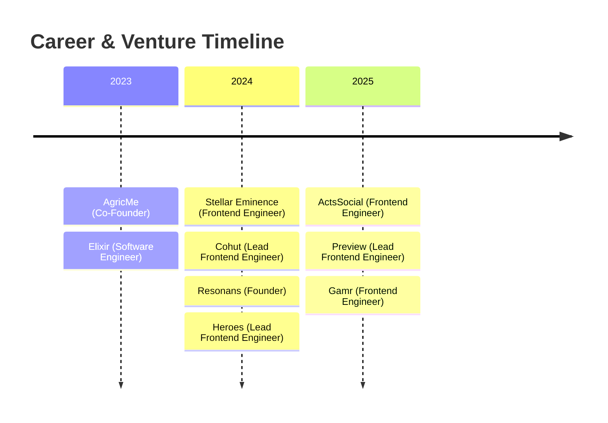

I# 💫 Isaac Oyedele

<div align="center">
  <h3><b>Software Engineer • Innovator • Product Builder</b></h3>
  <p>Ibadan, Nigeria</p>

  <p>
    <a href="https://linkedin.com/isaacoyedele"></a>
    <a href="https://github.com/isaacc20"></a>
    <a href="mailto:isaacoluwadarasimi002@gmail.com"></a>
    <a href="https://docs.google.com/document/d/1xKZVOFOMSfCT8XZE9Y3uHp7pZLFboAxKrhqC04krhjA/edit?tab=t.q0jqw4ro4f4l#heading=h.x8fm1uorkbaw"></a>
  </p>

  <h4>
    <b>🚀 4+ Years Experience &nbsp;•&nbsp; 🛠️ 20+ Projects Built &nbsp;•&nbsp; 🎯 100% Client Satisfaction</b>
  </h4>

  <hr />

  <blockquote>
    <b>"Websites That Convert. Products That Scale. Impact That Lasts."</b>
    <br />
    <i>Bridging the gap between high-level engineering and business growth. I build technical foundations for ventures that aim for the moon.</i>
  </blockquote>

  <hr />
</div>

## 📖 About Me

I’m a **product-minded software engineer** focused on frontend development. I build fast, responsive web applications with React, Next.js, TypeScript, and Tailwind, and scale with backend integrations when needed. My core mission is simple: **turn complex ideas into intuitive, enjoyable experiences**. 

I care deeply about craft, clarity, and creating things that matter. Currently, I am:
* 🌟 Leading **[Resonans](https://theresonans.com)** as Founder, helping academic researchers turn theoretical work into real-world impact (technologies, products, and policies).
* 🟢 **Available for select contracts, freelance roles, and collaborative projects.**

---

## 🛠️ Tech Stack & Toolkit

### **Frontend & Frameworks**
```
React • Next.js • TypeScript • JavaScript • Tailwind CSS • Bootstrap • HTML5 • CSS3
```
<p>
  
  
  
  
  
  
  
  
</p>

### **Backend & Databases**
```
Laravel • Firebase • Node.js
```
<p>
  
  
  
</p>

### **Design & Workflow**
```
Figma • Git • npm • Vite
```
<p>
  
  
  
  
</p>

---

## 💼 Work Experience



### **Career & Venture History**

* **Frontend Engineer** at **[Gamr](https://gamr.africa)** *(2025 - Present)*
  * Managing the frontend for web products, including **Brackets**, a premier tournament management platform.
  * *Technologies: React, TypeScript, Tailwind CSS.*
* **Lead Frontend Engineer** at **Preview** *(March - May 2025 | Contract)*
  * Led frontend development for Preview, an AI-powered hiring platform designed for sales recruiters.
  * *Technologies: React, TypeScript, Bootstrap.*
* **Frontend Engineer** at **[ActsSocial](https://actssocial.com)** *(February - May 2025 | Contract)*
  * Built the devotional feature UI/UX from design concepts into interactive Laravel-based components.
  * *Technologies: Laravel, React, TypeScript, Bootstrap.*
* **Founder** at **[Resonans](https://theresonans.com)** *(November 2024 - Present)*
  * Created a decentralized platform helping researchers spin out real-world solutions. Hosted major events, onboarded 30+ industry experts, and launched the initial MVP.
  * *Technologies: React, TypeScript, Bootstrap.*
* **Lead Frontend Engineer** at **[Cohut](https://cohut.co)** *(October 2024 - February 2025 | Contract)*
  * Drove the frontend development of a cohort management platform from concept to MVP.
  * *Technologies: React, TypeScript, Bootstrap.*
* **Frontend Engineer** at **[Stellar Eminence](https://stellareminence.com)** *(February - November 2024)*
  * Designed and built a high-performance web experience for the Stellar Eminence brand.
  * *Technologies: Next.js, TypeScript, Tailwind CSS.*
* **Technical Co-Founder** at **AgricMe** *(November 2023 - December 2024)*
  * Co-founded a platform connecting farmers to resources, driving MVP engineering.
  * *Technologies: Next.js, TypeScript, Tailwind CSS.*

---

## 💻 Past Featured Projects

### 🎮 **[Heroes](https://loquacious-medovik-30c0f7.netlify.app/play)**
* **Role:** Lead Frontend Engineer
* **Description:** An interactive, web-based gaming platform featuring a drag-and-drop system matching heroes to their creators. Led a team of 8 to develop the experience.
* *Technologies:* React, TypeScript, Bootstrap

### 🛍️ **[Elixir](https://the-elixir-brand.netlify.app)**
* **Role:** Software Engineer
* **Description:** A full-stack e-commerce experience built entirely without preset UI designs, complete with database and payment integration.
* *Technologies:* React, Firebase, Bootstrap

---

## 📫 Let's Connect!

If you have an interesting project, need a frontend developer who understands the product/business side, or want to talk about research translation, let's talk!

<div align="center">
  <p>
    ✉️ <b>Email:</b> <a href="mailto:isaacoluwadarasimi002@gmail.com">isaacoluwadarasimi002@gmail.com</a> &nbsp;|&nbsp; 
    🤝 <b>LinkedIn:</b> <a href="https://linkedin.com/isaacoyedele">/in/isaacoyedele</a> &nbsp;|&nbsp; 
    📸 <b>Instagram:</b> <a href="https://instagram.com/hyzeekoyedele">@hyzeekoyedele</a>
  </p>

  <p>
    <a href="mailto:isaacoluwadarasimi002@gmail.com?subject=Inquiry%20from%20GitHub"><b>[ HIRE ME ]</b></a> &nbsp;•&nbsp; 
    <a href="https://docs.google.com/document/d/1xKZVOFOMSfCT8XZE9Y3uHp7pZLFboAxKrhqC04krhjA/edit?tab=t.q0jqw4ro4f4l#heading=h.x8fm1uorkbaw"><b>[ VIEW MY CV ]</b></a>
  </p>
</div>